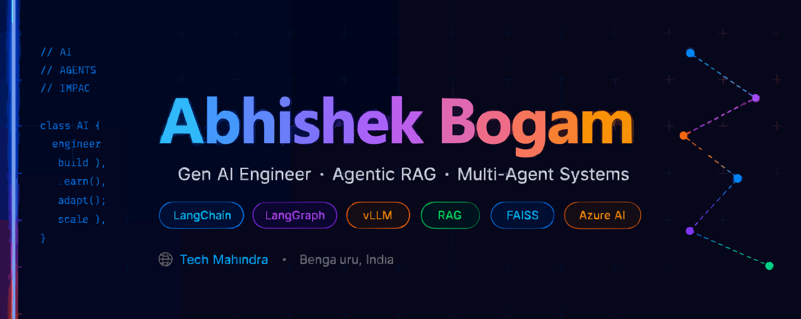

  

 

# Hey, I'm Abhishek 👋 ~

### Gen AI Engineer · Agentic RAG · Multi-Agent Systems

💼 **Associate Software Engineer @ Tech Mahindra**

Currently driving **RAN AI Automation for Rakuten** — building intelligent pipelines that automate 4G/5G (3GPP) test case generation using Agentic RAG and multi-agent reasoning.

Previously, I engineered end-to-end LLM systems across RAG, agent orchestration, and on-premise LLM deployment — always with a focus on making AI reliable in production, not just in demos.

---

## 🔭 What I'm Up To

**Now →** RAN AI Automation for Rakuten (via Tech Mahindra) — Agentic RAG over 3GPP telecom specs, automating test case generation with multi-step LLM reasoning pipelines

**Before →** Built agentic pipelines, on-prem LLM deployments (vLLM, OpenVINO), RAG systems with FAISS & ChromaDB, and multi-agent workflows with LangGraph

**Always →** Obsessing over making LLMs actually useful at scale — accurate retrieval, low hallucination, fast inference

---

## 🛠️ Skills & Tech Stack

**Generative AI & RAG**

**LLM Inference & Models**

**Multi-Agent Systems**

**Backend & APIs**

**Frontend**

**Data & Databases**

**Cloud & Tools**

---

## 🏅 Certifications

---

### *"Don't just build AI demos — build AI that survives production."*

**Bengaluru, India 🇮🇳 · Open to collaborate · Always building**

